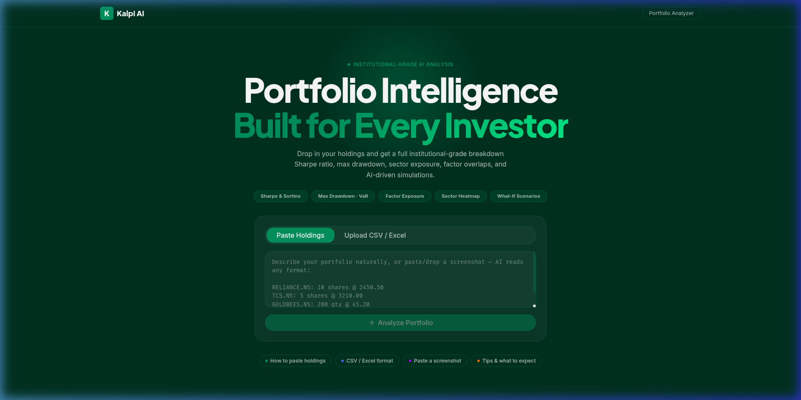
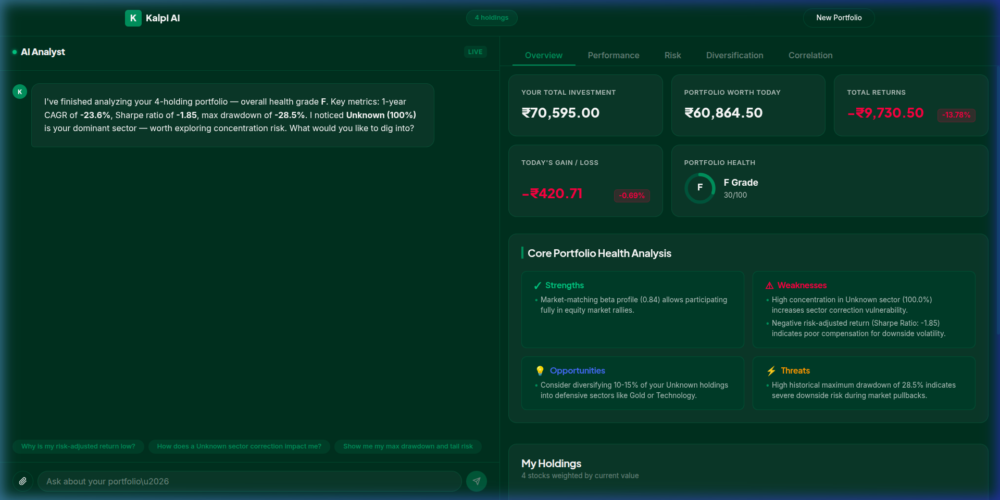
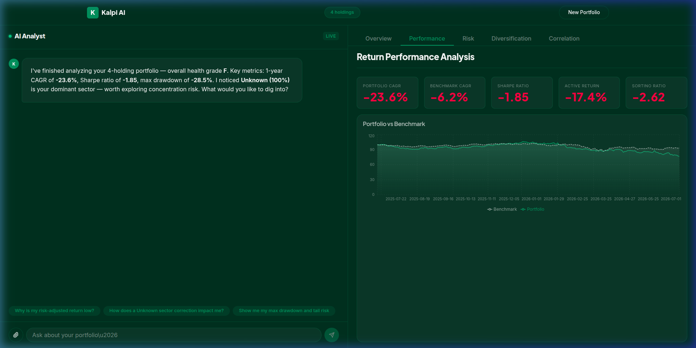
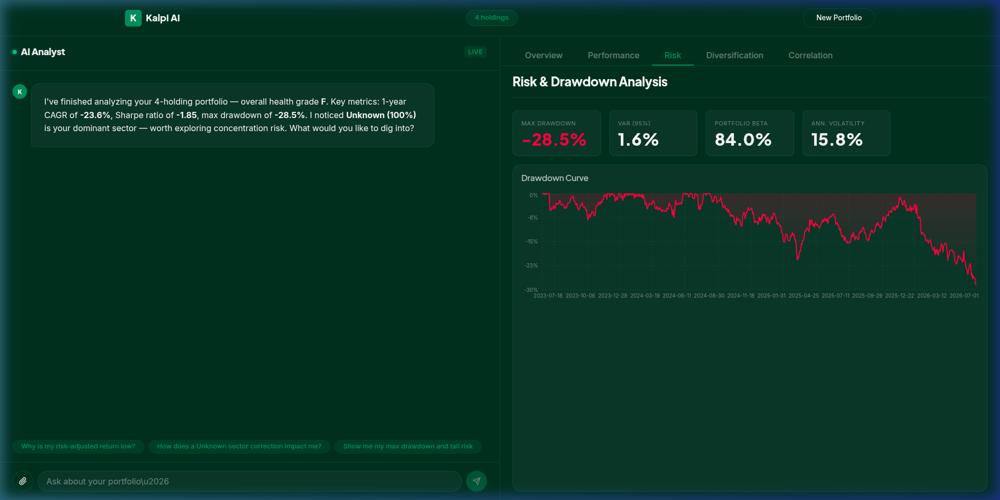
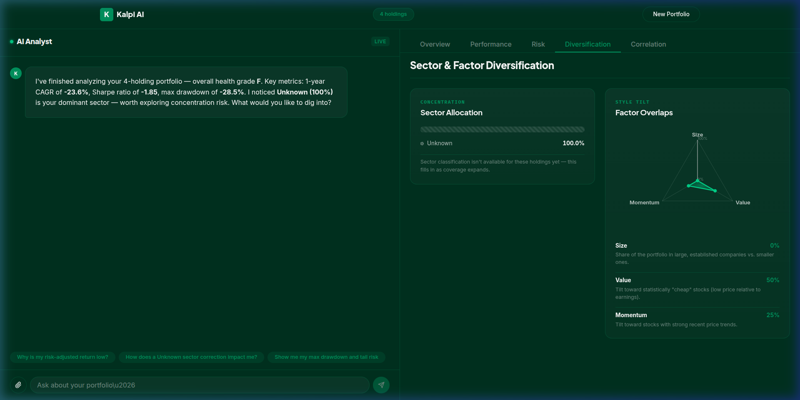
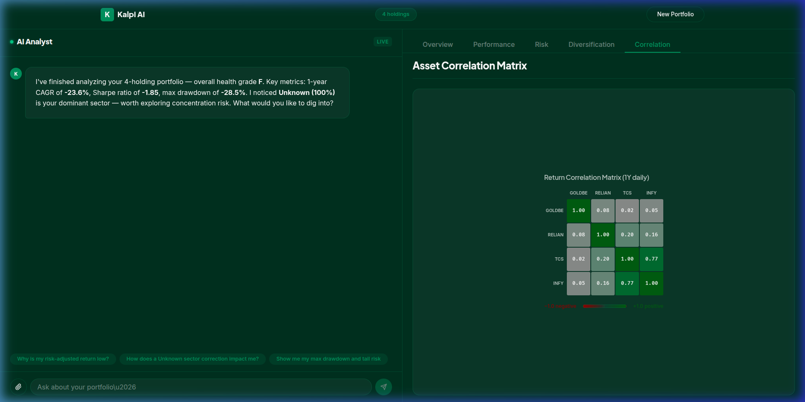
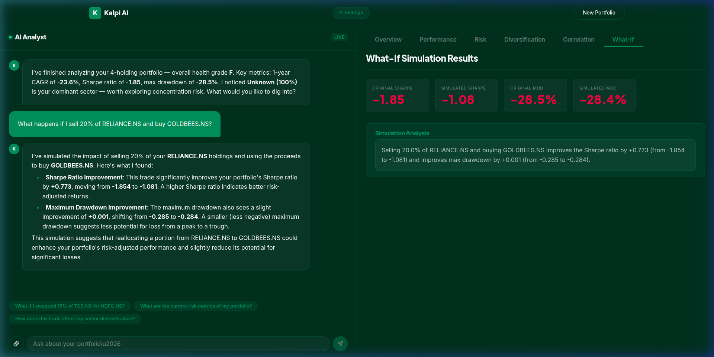
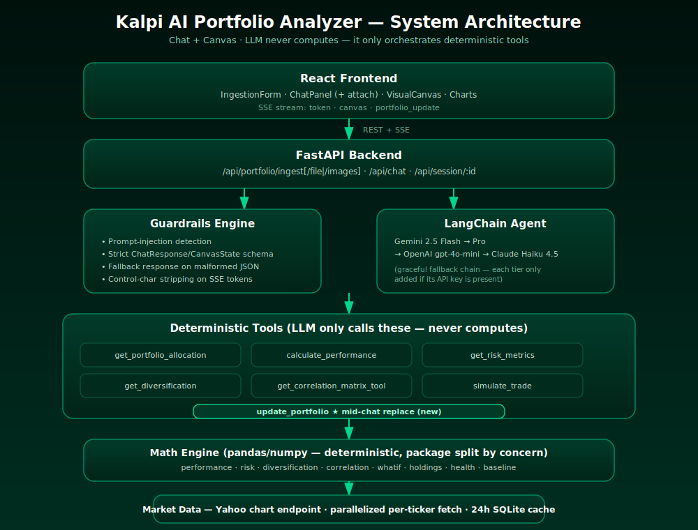
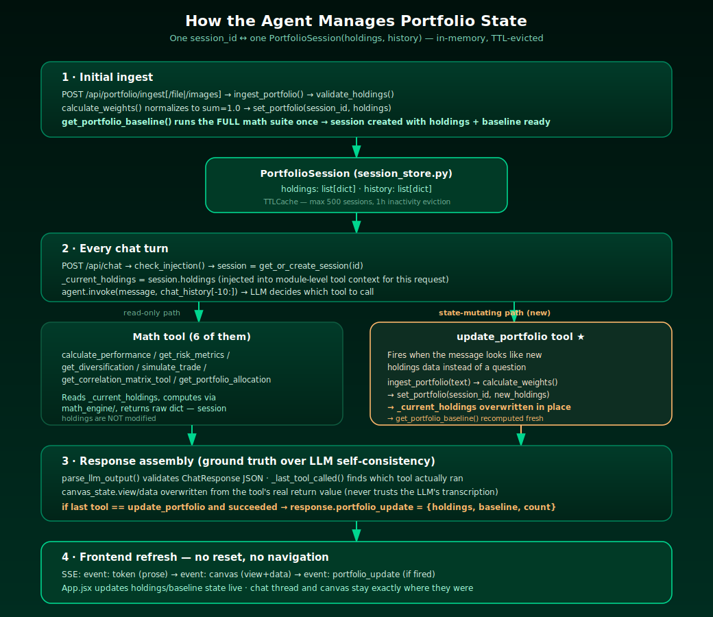

# 📊 Kalpi AI Portfolio Analyzer

An institutional-grade AI portfolio analyzer that turns raw investment data into personalized, interactive financial insights through a **Chat + Canvas** interface.

---

## 🎨 Visual Walkthrough & Interface

Kalpi AI separates user interactions into a conversational chat panel and a dynamic visual canvas that displays real-time charts and financial metrics.

### 1. Ingestion Interface
Get started by typing your holdings naturally, pasting text, or dragging and dropping a CSV or Excel file. The system also supports uploading screenshots of investment dashboards directly.


### 2. Portfolio Overview & Asset Allocation
Once loaded, the default canvas shows a complete overview of holdings, purchase prices, weight allocations, and current values.


### 3. Financial Performance Tab
Analyze historical compound annual growth rates (CAGR), Sharpe ratios, Sortino ratios, and compare cumulative performance against benchmark indices (e.g., Nifty 50 or S&P 500).


### 4. Risk & Drawdown Profile
Uncover volatility, portfolio Beta, Value at Risk (VaR at 95%), and historical drawdown curves to expose tail risks.


### 5. Sector Allocation & Factor Exposure
Audit concentration risk with interactive sector breakdowns and a style-tilt radar chart mapping Size, Value, and Momentum factor overlaps.


### 6. Asset Correlation Matrix
Understand how assets move in tandem. This interactive daily return correlation matrix heatmap exposes hidden correlations.


### 7. What-If Simulation
Simulate asset swaps or adjustments (e.g., *"What happens if I sell 20% of RELIANCE.NS and buy GOLDBEES.NS?"*) and view instant comparisons of Sharpe ratios and Maximum Drawdown delta.


---

## ⚙️ System Architecture

Kalpi AI is built using **React 19** on the frontend and **FastAPI** on the backend. The core coordination uses **LangChain** with **Gemini 2.5 Flash** (and automatic failover to **Gemini 2.5 Pro**, **GPT-4o-mini**, or **Claude Haiku**).



---

## 💾 State Management & Session Lifecycle

To support conversational context and seamless portfolio adjustments, Kalpi AI implements an in-memory session store. Here is a technical breakdown of how this state is managed, along with current architectural constraints and design decisions:

1. **In-Memory Store (`InMemorySessionStore`)**: 
   Sessions are stored in RAM within a cache (`_sessions: dict[str, PortfolioSession]`) with a 500-session limit and a 1-hour idle eviction TTL. Each session holds the current normalized holdings list and a chat history (the last 10 messages of which are passed to the LLM as windowed context).
   
2. **Tool Context & Concurrency Debt**: 
   In [agent.py](file:///home/letbu/Documents/kalpi_ai/backend/app/agent.py), the active portfolio context is bound via module-level globals `_current_holdings` and `_current_session_id`. When a tool runs, it retrieves data from these variables.
   > [!WARNING]
   > This design is not thread-safe under concurrent requests from different sessions. It represents a conscious MVP tradeoff to keep the LangChain tool signatures clean (since LangChain tools do not receive runtime session parameters natively). In a production deployment, this state should be managed by extracting session IDs directly from tool input signatures or storing active user profiles inside a shared database / Redis cache.

3. **Session Lifecycle Sequence Flow**:



---

## 🛠️ Key Design & Engineering Decisions

### 1. The Golden Rule (LLM Orchestration vs. Math)
The LLM never computes a single number. It acts strictly as an orchestrator. If the user asks for historical volatility, the LLM parses the intent, triggers the `get_risk_metrics` tool, receives the mathematically exact metrics computed via `pandas`/`numpy` in Python, and translates those numbers into prose. This guarantees **zero mathematical hallucinations**.

### 2. Deterministic Canvas Synchronization (The Visuals Fix)
When the LLM outputs its response JSON, it is supposed to output `canvas_state.view` (e.g., `'performance'`) and duplicate the raw tool data in `canvas_state.data`. However, LLMs sometimes experience "context slip" and output the wrong view name or fail to faithfully transcribe the full tool JSON.
* **The Fix**: The backend intercepts the agent's tool-call history. It looks up which tool was *actually* called (ground truth) using `_last_tool_called()` and overwrites both `canvas_state.view` and `canvas_state.data` in the final server response. The LLM has no control over the rendering state; the UI state is derived deterministically from which Python function ran.

### 3. Production Workaround for Yahoo Finance Rate Limits
Initially, `yfinance`'s `.info` and `.download()` methods failed under production cloud environments (such as Render) with `YFRateLimitError: Too Many Requests` due to Yahoo's strict cookie/crumb CSRF handshakes on shared hosting IP ranges.
* **The Fix**: The market data module bypasses the standard `yfinance` library wrapper. Instead, it calls Yahoo's crumb-free `/v8/finance/chart/{symbol}` endpoint directly. This endpoint returns prices, currencies, and exchange metadata reliably without authentication.
* **Caching**: All external market requests are cached locally in a SQLite database via `requests_cache` with a 24-hour TTL, saving bandwidth and preventing rate limit blocks on identical tickers.

### 4. Mid-Chat Portfolio Updates
A user can replace their active portfolio mid-conversation without wiping their chat thread or resetting their view:
* **Pasted Text**: The system prompt instructs the agent that if a message looks like a portfolio table or raw holdings details, it must trigger the `update_portfolio(raw_text)` tool. This parses the text, calculates weights, overwrites the session store holdings, and returns the new baseline which is sent to the frontend via SSE.
* **Attachments**: An attachment button in the chat panel routes CSVs or screenshots directly to `/api/portfolio/ingest/file` or `/api/portfolio/ingest/images` with the current `session_id`, updating the active RAM holdings. The frontend appends a summary of the change to the chat thread dynamically.



---

## 🛡️ Guardrails & Safety

* **Prompt Injection Shield**: [guardrails.py](file:///home/letbu/Documents/kalpi_ai/backend/app/guardrails.py) checks incoming text against blocklists (e.g., *"ignore previous instructions"*, *"system prompt"*) using unicode-normalization to catch obfuscation tricks (like zero-width spaces or full-width homoglyphs). Inputs exceeding 1000 characters are blocked.
* **Structured Output Validation**: LLM outputs must conform to a strict Pydantic JSON schema (`ChatResponse`). If parsing fails, a fallback parser recovers the prose text and generates a safe default schema to prevent app crashes.
* **Rate Limiting**: Built using `slowapi`. Ingestion endpoints are restricted to 10 requests/minute, image-screenshot processing to 5/minute, and conversational chat requests to 20/minute.

---

## 🚀 Setup & Run Guide

### Prerequisites
* Python 3.11+
* Node.js 20+
* Google Cloud Platform service account credentials (set as `GOOGLE_CREDENTIALS_JSON` in your backend `.env` for Gemini Vertex AI access).

### 1. Backend Setup
Navigate to the `backend/` directory, set up your virtual environment, install dependencies, and start Uvicorn:

```bash
cd backend
python3 -m venv venv
source venv/bin/activate
pip install -r requirements.txt
pip install -r requirements-dev.txt

# Copy credentials and set keys
cp .env.example .env
# Edit .env to set GOOGLE_CREDENTIALS_JSON or ANTHROPIC_API_KEY

# Start the FastAPI server
python3 -m uvicorn app.main:app --port 8000 --reload
```

### 2. Frontend Setup
Navigate to the `frontend/` directory, install Node packages, and run the Vite server:

```bash
cd frontend
npm install
npm run dev
```
Open `http://localhost:5173/` in your browser.

### 3. Running Backend Tests
Ensure your environment is set up and execute the pytest suite (100+ tests spanning mathematical validation, ingestion, guardrails, and APIs):

```bash
cd backend
pytest tests/ -v
```

---

## 📁 Project Directory Structure

```
kalpi_ai/
├── backend/
│   ├── app/
│   │   ├── math_engine/       # Deterministic quantitative financial formulas
│   │   │   ├── performance.py   # CAGR, Sharpe, Sortino, Benchmarks
│   │   │   ├── risk.py          # Drawdowns, Volatility, VaR, Beta
│   │   │   ├── diversification.py# Sectors, style tilts, and factor radars
│   │   │   ├── correlation.py   # Daily return correlation matrices
│   │   │   ├── whatif.py        # Portfolio swap trade simulations
│   │   │   ├── health.py        # Score calculations & SWOT synthesis
│   │   │   └── baseline.py      # Combines math results for initial state
│   │   ├── main.py            # FastAPI endpoints, routes, and middlewares
│   │   ├── agent.py           # LangChain ReAct agent + math tool wrappers
│   │   ├── ingestion.py       # Parses CSV/Excel, pasted text, and screenshots
│   │   ├── market_data.py     # Yahoo Finance direct chart query utility
│   │   ├── guardrails.py      # Injection blocklist and LLM output parsing
│   │   ├── session_store.py   # In-memory RAM storage with eviction TTLs
│   │   └── models.py          # Pydantic schemas for verification
│   ├── tests/                 # Unit & integration testing suite
│   ├── requirements.lock      # Pinned production requirements
│   └── requirements-dev.txt   # Test libraries (pytest, mock, respx)
├── frontend/
│   ├── src/
│   │   ├── components/        # ChatPanel, VisualCanvas, Recharts wrappers
│   │   ├── hooks/             # useIngestion, useChat custom React hooks
│   │   ├── api/               # REST client configurations
│   │   ├── App.jsx            # Main app coordination and SSE handlers
│   │   └── index.css          # Theme, layouts, and glassmorphism styling
│   └── package.json
├── docs/
│   └── screenshots/           # Screenshot assets referenced in documentation
└── README.md                  # System overview and tech specification
```
